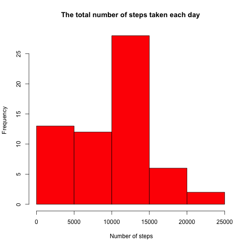
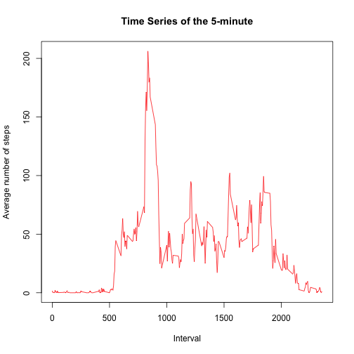
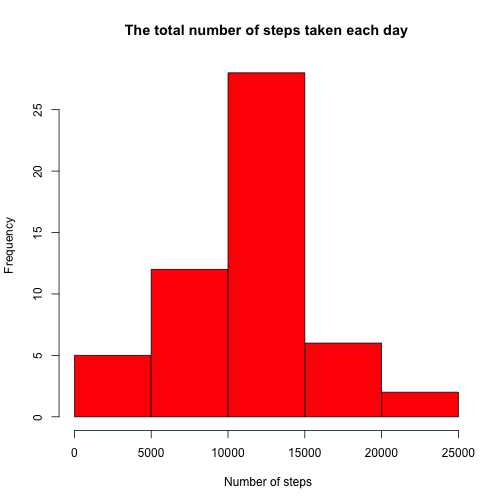
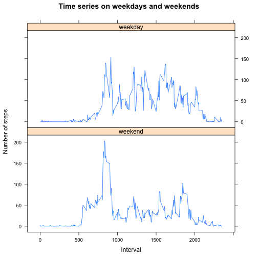

# Reproducible Research: Peer Assessment 1

## Loading and preprocessing the data
1. Load the data

Load libraries

```r
library(data.table)
```

```
## data.table 1.9.6  For help type ?data.table or https://github.com/Rdatatable/data.table/wiki
```

```
## The fastest way to learn (by data.table authors): https://www.datacamp.com/courses/data-analysis-the-data-table-way
```

```r
library(lattice)
```

Read csv file

```r
if (!file.exists("activity.zip")) {
      return
}

unzip("activity.zip")

activity <- read.csv("activity.csv")
```

There are 17568 rows and 3 cols.  
The data looks like:

```r
head(activity)
```

```
##   steps       date interval
## 1    NA 2012-10-01        0
## 2    NA 2012-10-01        5
## 3    NA 2012-10-01       10
## 4    NA 2012-10-01       15
## 5    NA 2012-10-01       20
## 6    NA 2012-10-01       25
```

2. Process/transform the data (if necessary) into a format suitable for your analysis

Convert data.frame to data.table using data.table package. data.table is much faster than data.frame.

```r
DT <- as.data.table(activity)
```

------

## What is mean total number of steps taken per day?
1. Calculate the total number of steps taken per day

```r
dt1 <- DT[, .(total = sum(steps, na.rm = TRUE)), by=date]

summary(dt1)
```

```
##          date        total      
##  2012-10-01: 1   Min.   :    0  
##  2012-10-02: 1   1st Qu.: 6778  
##  2012-10-03: 1   Median :10395  
##  2012-10-04: 1   Mean   : 9354  
##  2012-10-05: 1   3rd Qu.:12811  
##  2012-10-06: 1   Max.   :21194  
##  (Other)   :55
```

2. If you do not understand the difference between a histogram and a barplot, research the difference between them. Make a histogram of the total number of steps taken each day

```r
hist(dt1$total, main="The total number of steps taken each day", xlab=" Number of steps", col="red")
```



3. Calculate and report the mean and median of the total number of steps taken per day

```r
mean(dt1$total, na.rm = TRUE)
```

```
## [1] 9354.23
```

```r
median(dt1$total, na.rm = TRUE)
```

```
## [1] 10395
```

------

## What is the average daily activity pattern?
1. Make a time series plot(i.e type="l") of the 5-minute interval (x-axis) and the average number of steps taken, averaged across all days (y-axis)

```r
dt2 <- DT[, .(mean_steps=mean(steps, na.rm = TRUE)), by=interval]
plot(dt2, type="l", main="Time Series of the 5-minute", xlab="Interval", ylab="Average number of steps", col="red")
```



2. Which 5-minute interval, on average across all the days in the dataset, contains the maximum number of steps?

```r
dt2[mean_steps==max(mean_steps)]
```

```
##    interval mean_steps
## 1:      835   206.1698
```

------

## Imputing missing values
Note that there are a number of days/intervals where there are missing values (coded as 𝙽𝙰). The presence of missing days may introduce bias into some calculations or summaries of the data.

1. Calculate and report the total number of missing values in the dataset (i.e. the total number of rows with NAs)
```
sum(is.na(DT))
```
The total number of missing values in the dataset: 2304

2. Devise a strategy for filling in all of the missing values in the dataset. The strategy does not need to be sophisticated. For example, you could use the mean/median for that day, or the mean for that 5-minute interval, etc.
```
Mean of steps by date willl be used for the missing value
```

3. Create a new dataset that is equal to the original dataset but with the missing data filled in.

```r
na_dt <- DT
na_dt[, steps:= replace(steps, is.na(steps), as.integer(mean(steps, na.rm=TRUE))), by=date]
print(na_dt)
```

```
##        steps       date interval
##     1:    NA 2012-10-01        0
##     2:    NA 2012-10-01        5
##     3:    NA 2012-10-01       10
##     4:    NA 2012-10-01       15
##     5:    NA 2012-10-01       20
##    ---                          
## 17564:    NA 2012-11-30     2335
## 17565:    NA 2012-11-30     2340
## 17566:    NA 2012-11-30     2345
## 17567:    NA 2012-11-30     2350
## 17568:    NA 2012-11-30     2355
```

4. Make a histogram of the total number of steps taken each day and Calculate and report the mean and median total number of steps taken per day. Do these values differ from the estimates from the first part of the assignment? What is the impact of imputing missing data on the estimates of the total daily number of steps?

```r
dt3 <- na_dt[, .(total = sum(steps), mean_steps=mean(steps)), by=date]
hist(dt3$total, main="The total number of steps taken each day", xlab=" Number of steps", col="red")
```



Imputing missing data made total value (x-axis) more wide range but y-axis has not been changed.

------

## Are there differences in activity patterns between weekdays and weekends?
For this part the weekdays() function may be of some help here. Use the dataset with the filled-in missing values for this part.

1. Create a new factor variable in the dataset with two levels – “weekday” and “weekend” indicating whether a given date is a weekday or weekend day.

```r
#as.POSIXlt(DT$date)$wday returns index of weekdays: staring on Sunday
typeOfDay <- factor(as.POSIXlt(DT$date)$wday %in% c(0,6), 
                    levels=c(FALSE, TRUE), 
                    labels = c("weekend", "weekday"))
dt4 <- DT
dt4[, daytype:=typeOfDay]

dt4
```

```
##        steps       date interval daytype
##     1:    NA 2012-10-01        0 weekend
##     2:    NA 2012-10-01        5 weekend
##     3:    NA 2012-10-01       10 weekend
##     4:    NA 2012-10-01       15 weekend
##     5:    NA 2012-10-01       20 weekend
##    ---                                  
## 17564:    NA 2012-11-30     2335 weekend
## 17565:    NA 2012-11-30     2340 weekend
## 17566:    NA 2012-11-30     2345 weekend
## 17567:    NA 2012-11-30     2350 weekend
## 17568:    NA 2012-11-30     2355 weekend
```

2. Make a panel plot containing a time series plot (i.e. 𝚝𝚢𝚙𝚎 = "𝚕") of the 5-minute interval (x-axis) and the average number of steps taken, averaged across all weekday days or weekend days (y-axis). See the README file in the GitHub repository to see an example of what this plot should look like using simulated data.

```r
dt4 <- dt4[, .(mean_steps=mean(steps, na.rm = TRUE)), by=.(interval, daytype)]
print(dt4)
```

```
##      interval daytype mean_steps
##   1:        0 weekend  2.3333333
##   2:        5 weekend  0.4615385
##   3:       10 weekend  0.1794872
##   4:       15 weekend  0.2051282
##   5:       20 weekend  0.1025641
##  ---                            
## 572:     2335 weekday 12.5714286
## 573:     2340 weekday  6.7142857
## 574:     2345 weekday  1.8571429
## 575:     2350 weekday  0.0000000
## 576:     2355 weekday  0.0000000
```

```r
xyplot(mean_steps~interval | daytype, data = dt4,
       type = "l",
       main = "Time series on weekdays and weekends",
       xlab = "Interval",
       ylab = "Number of steps",
       layout = c(1,2))
```


